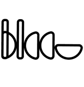
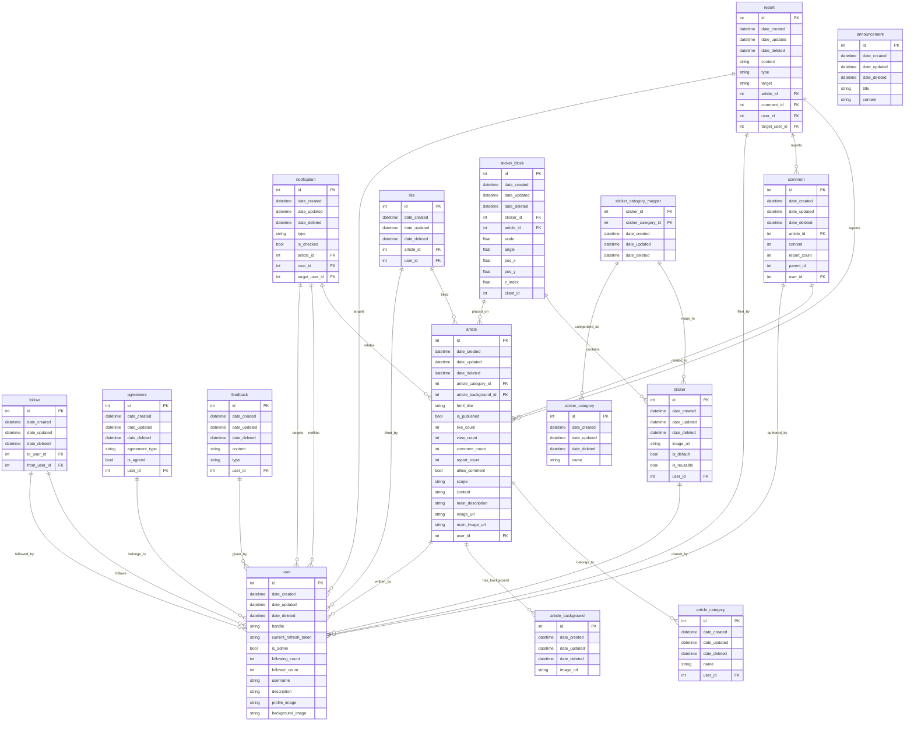

  
  <h1>블꾸</h1>
  
커스텀 극대화 블로그

  <a href="https://blccu.com">blccu.com</a>

## Tech Stack

- Nest.js
- mysql/typeORM

## ERD

```mermaid
erDiagram
    notification {
        int id PK
        datetime date_created
        datetime date_updated
        datetime date_deleted
        string type
        bool is_checked
        int article_id FK
        int user_id FK
        int target_user_id FK
    }
    follow {
        int id PK
        datetime date_created
        datetime date_updated
        datetime date_deleted
        int to_user_id FK
        int from_user_id FK
    }
    agreement {
        int id PK
        datetime date_created
        datetime date_updated
        datetime date_deleted
        string agreement_type
        bool is_agreed
        int user_id FK
    }
    feedback {
        int id PK
        datetime date_created
        datetime date_updated
        datetime date_deleted
        string content
        string type
        int user_id FK
    }
    article {
        int id PK
        datetime date_created
        datetime date_updated
        datetime date_deleted
        int article_category_id FK
        int article_background_id FK
        string html_title
        bool is_published
        int like_count
        int view_count
        int comment_count
        int report_count
        bool allow_comment
        string scope
        string content
        string main_description
        string image_url
        string main_image_url
        int user_id FK
    }
    article_category {
        int id PK
        datetime date_created
        datetime date_updated
        datetime date_deleted
        string name
        int user_id FK
    }
    article_background {
        int id PK
        datetime date_created
        datetime date_updated
        datetime date_deleted
        string image_url
    }
    user {
        int id PK
        datetime date_created
        datetime date_updated
        datetime date_deleted
        string handle
        string current_refresh_token
        bool is_admin
        int following_count
        int follower_count
        string username
        string description
        string profile_image
        string background_image
    }
    comment {
        int id PK
        datetime date_created
        datetime date_updated
        datetime date_deleted
        int article_id FK
        int content
        int report_count
        int parent_id
        int user_id FK
    }
    report {
        int id PK
        datetime date_created
        datetime date_updated
        datetime date_deleted
        string content
        string type
        string target
        int article_id FK
        int comment_id FK
        int user_id FK
        int target_user_id FK
    }
    like {
        int id PK
        datetime date_created
        datetime date_updated
        datetime date_deleted
        int article_id FK
        int user_id FK
    }
    sticker_block {
        int id PK
        datetime date_created
        datetime date_updated
        datetime date_deleted
        int sticker_id FK
        int article_id FK
        float scale
        float angle
        float pos_x
        float pos_y
        float z_index
        int client_id
    }
    sticker {
        int id PK
        datetime date_created
        datetime date_updated
        datetime date_deleted
        string image_url
        bool is_default
        bool is_reusable
        int user_id FK
    }
    sticker_category {
        int id PK
        datetime date_created
        datetime date_updated
        datetime date_deleted
        string name
    }
    sticker_category_mapper {
        int sticker_id FK
        int sticker_category_id FK
        datetime date_created
        datetime date_updated
        datetime date_deleted
    }
    announcement {
        int id PK
        datetime date_created
        datetime date_updated
        datetime date_deleted
        string title
        string content
    }

    notification ||--o{ article : relates
    notification ||--o{ user : notifies
    notification ||--o{ user : targets
    follow ||--o{ user : follows
    follow ||--o{ user : followed_by
    agreement ||--o{ user : belongs_to
    feedback ||--o{ user : given_by
    article ||--o{ article_category : belongs_to
    article ||--o{ article_background : has_background
    article ||--o{ user : written_by
    comment ||--o{ article : related_to
    comment ||--o{ user : authored_by
    report ||--o{ article : reports
    report ||--o{ comment : reports
    report ||--o{ user : filed_by
    report ||--o{ user : targets
    like ||--o{ article : liked
    like ||--o{ user : liked_by
    sticker_block ||--o{ sticker : contains
    sticker_block ||--o{ article : placed_on
    sticker ||--o{ user : owned_by
    sticker_category_mapper ||--o{ sticker : maps_to
    sticker_category_mapper ||--o{ sticker_category : categorized_as
```
